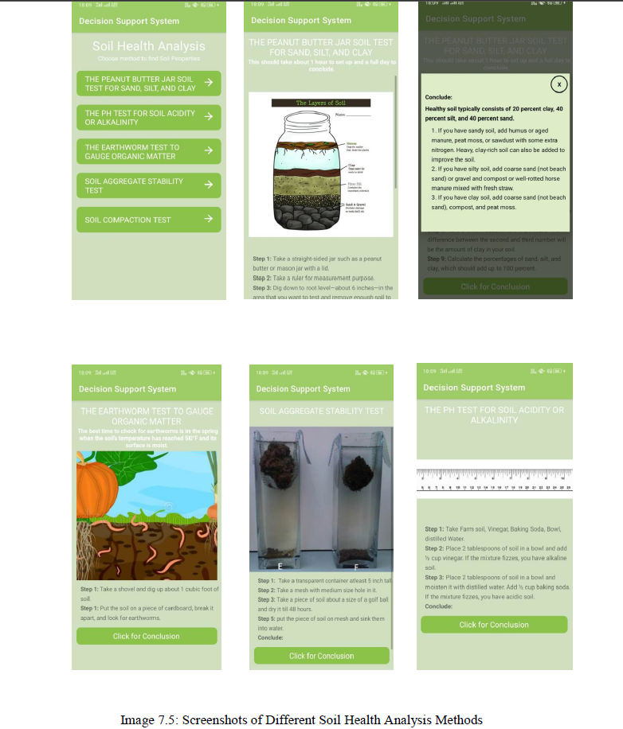

# Decision Support System
Engineered a Decision Support System with HTML, CSS, Python, and ML to process 10+ years of agricultural data, achieving 85% accuracy in crop yield predictions. Improved accuracy by 40% through enhanced analytics, real-time weather forecasts, and soil analysis. Developed a user-friendly interface with HTML, CSS, and PHP for seamless interaction.

# Goals
1. Develop a location-based crop suggestion system.
2. Build a system to extract soil features from satellite images.
3. Create an image classification model to identify soil types.
4. Gather data on climate, crops, and soil for datasets.
5. Analyze and filter collected data.
6. Implement home-based soil property extraction methods.
7. Predict crops using a multi-field input model.

# Objectives
1. Utilize remote sensing data to extract soil features.
2. Incorporate physical soil property data along with remote sensing data.
3. Collect a large dataset of soil type images for detection models.
4. Deploy models on Android and web applications.
5. Develop a chatbot to simplify home-based soil testing methods.
6. Create a system beneficial for agriculture.

# Homepage Desktop View

# ML Model Section (Soil Type Recognition)

# Soil Identification Model

# Homepage On Mobile Application

# Snaps of Different Soil Health Analysis Methods

# UI Of Chabot For Soil Testing Methods

    
